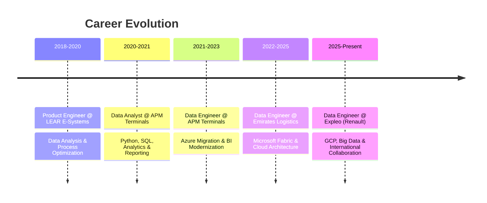

<div align="center">

<!-- Animated Header -->


<!-- Typing Animation -->
<a href="https://git.io/typing-svg"></a>

<!-- Social Badges with Animation -->
<p align="center">
  <a href="https://www.linkedin.com/in/hakkache-mohamed/"></a>
  <a href="mailto:Hakkache.mohamed@gmail.com"></a>
  <a href="https://github.com/hakkache"></a>
  
</p>

<!-- Profile Views Counter -->
<p align="center">
  
  
  
  <a href="https://www.linkedin.com/in/hakkache-mohamed/details/certifications/"></a>
</p>

</div>

---

## 🎯 About Me

```python
class DataEngineer:
    def __init__(self):
        self.name = "Mohamed Hakkache"
        self.role = "Senior Data Engineer & Cloud Solutions Architect"
        self.location = "Tangier, Morocco"
        self.experience_years = 6+
        self.certifications = 100+
        
    def current_work(self):
        return {
            "company": "Expleo Group",
            "client": "Renault Group",
            "project": "FOTA Testing Campaigns",
            "regions": ["Romania", "France", "Spain"],
            "focus": ["Data Pipelines", "GCP", "Analytics Automation"]
        }
    
    def expertise(self):
        return [
            "End-to-End Data Solutions",
            "Cloud Data Architecture",
            "Big Data Processing",
            "BI & Analytics",
            "Pipeline Automation",
            "Cross-functional Leadership"
        ]
    
    def life_motto(self):
        return "Transforming complex data into actionable insights! 🚀"
```

<div align="center">

### 💼 **Currently Building:** Real-time Data Pipelines for Automotive Testing | **Learning:** Advanced MLOps & DataOps | **Open to:** Exciting Data Engineering Opportunities

</div>

---

## 🛠️ Technology Arsenal

<div align="center">

### ☁️ Cloud Platforms & Big Data Ecosystem

<table>
<tr>
<td align="center" width="50%">

**Microsoft Azure**


</td>
<td align="center" width="50%">

**Google Cloud Platform**


</td>
</tr>
</table>

### 💻 Programming & Data Processing


### 🗄️ Databases & Storage


### 📊 BI & Visualization Tools


### 🔧 DevOps & Tools


</div>

---

## 💼 Professional Journey

<div align="center">



</div>

### 🚀 Current Role - Expleo Group (Renault Group)
**Data Engineer** | *April 2025 - Present* | 🌍 Romania, France, Spain

```yaml
Project: Firmware Over-The-Air (FOTA) Testing Campaigns
Responsibilities:
  - Design & automate: End-to-end data pipelines using GCP Data Fusion & Dataflow
  - Process: Large-scale test datasets and anomaly detection workflows
  - Analytics: Advanced SQL transformations in BigQuery for campaign monitoring
  - Visualize: Interactive dashboards in Looker Studio for stakeholder insights
  - Collaborate: International teams across 3 countries using Agile methodology
  - Optimize: Data storage, retrieval & governance across cloud infrastructure

Tech Stack: [GCP, BigQuery, Data Fusion, Dataflow, Looker Studio, Python, SQL, Git/GitLab]
```

### 📊 Emirates Logistics
**Data Engineer** | *September 2022 - April 2025* | 📍 Tangier, Morocco

<details>
<summary><b>🔽 Click to expand achievements</b></summary>

- 🏗️ **Architected** complete BI ecosystem using Microsoft Fabric & Power BI
- 🔄 **Developed** automated data pipelines in Azure Data Factory & Fabric Data Factory
- 🗄️ **Designed** optimized data models in Fabric Lakehouse & Azure SQL Database
- 🎯 **Created** semantic models & KPIs for logistics performance tracking
- 🔐 **Managed** data governance through Microsoft Purview & Entra ID
- 📈 **Deployed** real-time cloud dashboards for management analytics
- 👥 **Trained** end-users on self-service BI tools and data literacy

**Impact:** Unified data access across organization, improved decision-making speed by 40%

</details>

### ⚓ APM Terminals MedPort Tangier
**Data Engineer** | *March 2021 - April 2023* | 📍 Tangier, Morocco

<details>
<summary><b>🔽 Click to expand achievements</b></summary>

- ☁️ **Led** enterprise migration from on-premise to Azure cloud infrastructure
- 🔧 **Built** ETL pipelines integrating multiple systems via Azure Data Factory
- 📊 **Optimized** query performance in Azure Synapse Analytics
- 🌐 **Delivered** global terminal dashboards (Los Angeles, Algeciras, Rotterdam)
- ✅ **Established** BI governance frameworks reducing data inconsistencies by 60%
- 🔒 **Configured** Azure Data Gateway & RBAC through Azure Active Directory

**Impact:** Modernized analytics environment, reduced reporting time from days to hours

</details>

### 📈 APM Terminals MedPort Tangier
**Data Analyst** | *January 2020 - March 2021* | 📍 Tangier, Morocco

<details>
<summary><b>🔽 Click to expand achievements</b></summary>

- 📊 Analyzed operational datasets using Python & SQL for stakeholder insights
- 📉 Conducted Lean/Kaizen process improvement analysis
- 📱 Delivered automated KPI dashboards in MicroStrategy
- 🤝 Partnered with IT/BI teams for data integrity & governance

</details>

### 🔧 LEAR E-Systems
**Product Engineer** | *September 2018 - January 2020* | 📍 Tangier

<details>
<summary><b>🔽 Click to expand achievements</b></summary>

- 📊 Analyzed production data for material usage & cost optimization
- 📋 Designed technical documentation (BOMs, routing) with high accuracy
- 💰 Developed monthly KPI reports for project performance tracking
- 🔄 Implemented continuous improvement initiatives using data insights

</details>

---

## 📜 Certifications Showcase

<div align="center">

### 🏆 100+ Professional Certifications from Leading Tech Companies

<table>
<tr>
<td align="center" width="33%">

**🔵 Microsoft**


</td>
<td align="center" width="33%">

**🔴 Google Cloud**


</td>
<td align="center" width="33%">

**🟠 Databricks**


</td>
</tr>
</table>

#### 🎓 Recent Certifications (2025)
- ✅ **[Google Cloud Data Analytics Specialization](https://www.coursera.org/account/accomplishments/specialization/0GG5JZESCU94)** - Google Cloud (Oct 2025)
- ✅ **[Microsoft Azure Data Fundamentals DP-900](https://www.coursera.org/account/accomplishments/specialization/WKRGBAERWO65)** - Microsoft (Oct 2025)
- ✅ **[Databricks Certified Data Engineer Associate](https://www.udemy.com/certificate/UC-0acfc3b0-0333-4f07-b633-f550ece1d0dd/)** - Bootcamp (Oct 2025)
- ✅ **[Data Engineering, Big Data & ML on GCP](https://www.coursera.org/account/accomplishments/specialization/DOKNVFQACHMG)** - Google Cloud (Sep 2025)
- ✅ **[Cloud Data Engineer Specialization](https://www.coursera.org/account/accomplishments/specialization/7SR5OZH6ER5I)** - Google Cloud (Sep 2025)

#### 🎖️ Core Specializations
- 🏅 **[Power BI Data Analyst](https://www.coursera.org/account/accomplishments/specialization/certificate/MSARE4DERMGD)** - Microsoft (Dec 2023)
- 🏅 **[Natural Language Processing](https://www.coursera.org/account/accomplishments/specialization/certificate/KRF8YZL2UR99)** - DeepLearning.AI (Jun 2023)
- 🏅 **[Google Business Intelligence](https://www.coursera.org/account/accomplishments/specialization/certificate/WPGM4RJKFJYQ)** - Google (May 2023)
- 🏅 **[Google Data Analytics](https://www.coursera.org/account/accomplishments/specialization/certificate/MSARE4DERMGD)** - Google (Apr 2023)
- 🏅 **[Deep Learning Specialization](https://www.coursera.org/account/accomplishments/specialization/certificate/DG7HB99ZKMPH)** - DeepLearning.AI (Jul 2018)
- 🏅 **[Six Sigma ICCB](https://iassc.org/contact/verify-a-certificate/)** - IASSC (Oct 2016)

<a href="https://www.linkedin.com/in/hakkache-mohamed/details/certifications/"></a>

</div>

---

## 📊 GitHub Analytics

<div align="center">
  
  
</div>

<div align="center">
  
</div>

<div align="center">
  
</div>

---

## 🎯 Core Competencies

<div align="center">

| 🏗️ Data Architecture | ☁️ Cloud Engineering | 📊 Analytics & BI |
|:---:|:---:|:---:|
| Data Modeling (ERD, UML) | Azure Solutions | Power BI Development |
| Data Warehousing | GCP Infrastructure | Dashboard Design |
| ETL/ELT Pipeline Design | Cloud Migration | KPI Development |
| Data Lake Architecture | Multi-Cloud Strategy | Self-Service Analytics |

| 🔄 Data Processing | 🔐 Governance & Security | 🤝 Collaboration |
|:---:|:---:|:---:|
| Apache Spark | Data Governance | Agile (Scrum/Kanban) |
| Stream Processing | Microsoft Purview | Cross-functional Teams |
| Batch Processing | Azure Active Directory | Stakeholder Management |
| Real-time Analytics | RBAC Implementation | Technical Leadership |

</div>

---

## 🎓 Education

<div align="center">

```diff
+ State Engineer in Industrial Engineering
! The School of Textiles and Clothing Industries (ESITH), Casablanca
@ 2011 - 2015

+ Higher Engineering School Preparatory Classes (CPGE)
! Mathematics & Physics Intensive Program
@ 2008 - 2011

+ Baccalaureus in Mathematical Sciences
! Honors: Very Good
@ 2008
```

</div>

---

## 🌟 What Drives Me

<div align="center">

<table>
<tr>
<td align="center" width="25%">

<br><b>Lifelong Learner</b>
<br>
<sub>Constantly upskilling with latest technologies</sub>
</td>
<td align="center" width="25%">

<br><b>Results Focused</b>
<br>
<sub>Delivering measurable business impact</sub>
</td>
<td align="center" width="25%">

<br><b>Problem Solver</b>
<br>
<sub>Tackling complex data challenges</sub>
</td>
<td align="center" width="25%">

<br><b>Team Player</b>
<br>
<sub>Bridging technical & business teams</sub>
</td>
</tr>
</table>

### 💡 Current Interests


</div>

---

## 🌍 Languages

<div align="center">


</div>

---

## 📬 Let's Connect & Collaborate!

<div align="center">

### 🤝 Open to exciting opportunities in Data Engineering, Cloud Architecture, and Big Data!

<p align="center">
  <a href="mailto:Hakkache.mohamed@gmail.com">
    
  </a>
  <a href="https://www.linkedin.com/in/hakkache-mohamed/">
    
  </a>
  <a href="https://github.com/hakkache">
    
  </a>
</p>

### 💬 *"Data is the new oil, but insights are the refined fuel that powers innovation!"* ⚡

---

<p align="center">
  
</p>

### ⭐ If you find my work interesting, consider giving a star to my repositories!


</div>
